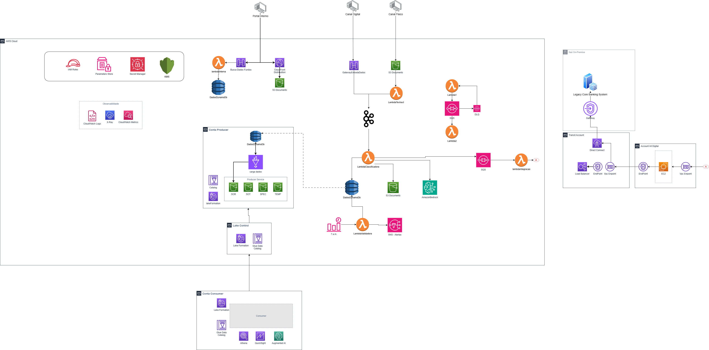

# Microserviço de Classificação Automática de Reclamações

## 📋 Visão Geral

Este é um **microserviço Lambda** para classificação automática de reclamações bancárias usando processamento de linguagem natural (NLP). O serviço recebe texto de reclamação como entrada e retorna as categorias automaticamente identificadas com níveis de confiança.

**Propósito:** Peça central do sistema de gerenciamento de reclamações do Itaú Unibanco. Responsável pela análise e classificação automática de texto de reclamação, eliminando a necessidade de classificação manual e acelerando o fluxo de tratamento.

---

## 🧱 Funcionalidades Principais

- **Classificação Automática de Reclamações**: Análise de texto em linguagem natural para identificar automaticamente as categorias de reclamação com níveis de confiança.
- **Múltiplas Estratégias NLP**: Implementação de 3 estratégias complementares (Keyword Matching, TF-IDF, N-grams) para melhor precisão na classificação.
- **Validação de Dados Robusta**: Validação rigorosa de CPF e email dos clientes para garantir integridade dos dados de entrada.
- **Processamento Stateless**: Arquitetura sem estado, pronta para escalabilidade em AWS Lambda e ambientes serverless.
- **Sem Dependências Externas**: Apenas utiliza a biblioteca padrão do Python, resultando em menor tamanho de pacote e tempo de inicialização mais rápido no Lambda.
- **Classificação com Confiança**: Cada categoria retornada inclui um score de confiança (0-1), permitindo filtros downstream mais inteligentes.

---

## 🏛️ Arquitetura e Estrutura

### Filosofia Arquitetural

A solução adota uma abordagem híbrida que combina **Layered Architecture** com **Clean Architecture** e princípios de **Domain-Driven Design (DDD)**. Essa escolha estratégica estabelece:

- **Layered Architecture**: Uma clara separação entre camadas (Domain e Application) para organização e manutenibilidade.
- **Clean Architecture**: A regra de dependência garante que a lógica de classificação (services) permaneça independente de detalhes de infraestrutura, tornando o core altamente testável e agnóstico a tecnologias externas (API, BD, framework).
- **Domain-Driven Design**: O código reflete fielmente o domínio do negócio (classificação de reclamações), com entidades, value objects e serviços que representam conceitos bancários reais.

Essa abordagem resulta em um sistema resiliente, fácil de testar e pronto para evolução futura.

### Estrutura de Pastas

```
reclamacoes-system/
├── src/                             # Camada de Negócio (Domain + Application)
│   ├── domain/                      # Camada de Domínio: Lógica de negócio pura
│   │   ├── enums.py                # Enumerações (Canal, StatusReclamacao)
│   │   ├── entities.py             # Entidades (CategoriaReclamacao)
│   │   ├── value_objects.py        # Value Objects (DadosCliente com validações)
│   │   ├── services.py             # Serviços: ClassificadorReclamacoes (NLP core)
│   │   └── __init__.py
│   │
│   └── application/                # Camada de Aplicação: Orquestração de casos de uso
│       ├── dtos.py                 # DTOs (ClassificacaoRequest/Response)
│       ├── interfaces.py           # Interfaces (contratos)
│       ├── use_cases.py            # Handlers (ClassificacaoHandler)
│       └── __init__.py
│
├── tests/                          # Camada de Testes (100% cobertura)
│   ├── test_classificador.py       # Testes do serviço NLP
│   ├── test_dados_cliente.py       # Testes de value objects e validações
│   ├── test_handler.py             # Testes do orquestrador
│   ├── test_lambda_handler.py      # Testes da integração Lambda
│   ├── conftest.py                 # Configurações e fixtures de testes
│   └── __init__.py
│
├── diagrams/                       # Documentação Visual
│   └── fluxo_classificacao.md      # Diagramas Mermaid do fluxo
│
├── lambda_handler.py               # Entry point para AWS Lambda (RAIZ)
├── main.py                         # Script auxiliar (RAIZ)
├── requirements.txt                # Dependências (produção + testes) (RAIZ)
├── pytest.ini                      # Configuração do pytest (RAIZ)
├── README.md                       # Esta documentação (RAIZ)
└── .gitignore                      # Configuração git (RAIZ)

```

---

## 🛠️ Stack Tecnológica

| Categoria | Tecnologia | Finalidade |
|-----------|-----------|-----------|
| **Linguagem** | Python 3.11+ | Runtime para o microserviço |
| **Framework** | Stdlib apenas | Sem dependências externas em produção |
| **NLP** | Algoritmos customizados | Keyword Matching, TF-IDF, N-grams |
| **Entrada/Saída** | JSON | Formato padrão para Lambda/API Gateway |
| **Validação** | Algoritmo de dígito verificador | CPF validation (mod 11) |
| **Deploy** | AWS Lambda | Execução serverless |
| **Testes** | pytest | Framework de testes |
| **Cobertura** | pytest-cov | Cobertura de código |
| **Configuração** | python-dotenv | Variáveis de ambiente |

---

## 📊 Diagramas de Fluxo

Para visualizar o fluxo completo de classificação, detalhamento das estratégias NLP, arquitetura em camadas e tratamento de erros, consulte:

📁 **[diagrams/fluxo_classificacao.md](diagrams/fluxo_classificacao.md)**

Contém 6 diagramas Mermaid interativos:
1. **Fluxo Principal** - Do evento Lambda até a resposta HTTP
2. **Estratégias de Matching** - As 3 estratégias NLP com pesos
3. **Arquitetura em Camadas** - Domain, Application e Entry Point
4. **Validação de Dados** - Fluxo de validação de entrada
5. **Normalização de Texto** - Pipeline de preprocessamento
6. **Tratamento de Erros** - Fluxo de captura e resposta de exceções

---

## 📐 Estrutura Detalhada - Camada de Domínio

A camada de domínio encapsula a lógica de negócio pura e é totalmente independente de detalhes técnicos.

```
src/domain/
├── enums.py
│   └── Canal (INTRANET, APPS, RECLAME_AQUI, etc.)
│   └── StatusReclamacao (PENDENTE, PROCESSADA, etc.)
├── entities.py
│   └── CategoriaReclamacao
│       ├── nome: str
│       ├── confianca: float
│       └── normalizar_pontuacao()
├── value_objects.py
│   └── DadosCliente (Imutável)
│       ├── cpf: str (validado com mod 11)
│       ├── email: str (validado com regex)
│       ├── telefone: str (opcional)
│       └── validar() → raises ValueError
├── services.py
│   └── ClassificadorReclamacoes (Serviço de Domínio)
│       ├── estrategia_keyword_matching()
│       ├── estrategia_tfidf()
│       ├── estrategia_ngrams()
│       ├── classificar(texto) → List[CategoriaReclamacao]
│       ├── adicionar_categoria(nome)
│       └── remover_categoria(nome)
└── __init__.py
```

**Responsabilidades:**
- Contém regras de negócio imutáveis (como a validação de CPF)
- Define as entidades que representam o domínio (Categoria, Cliente)
- Implementa serviços especializados (ClassificadorReclamacoes)
- Não conhece detalhes de como os dados são persistidos ou transmitidos

---

## 📐 Estrutura Detalhada - Camada de Aplicação

A camada de aplicação orquestra os casos de uso, conectando o domínio com o mundo externo.

```
src/application/
├── dtos.py
│   ├── ClassificacaoRequest
│   │   └── texto: str (obrigatório, não vazio)
│   └── ClassificacaoResponse
│       ├── sucesso: bool
│       ├── texto: str
│       ├── categorias: List[CategoriaReclamacao]
│       └── to_dict() → JSON-serializable
├── interfaces.py
│   └── IClassificador (contrato para classificadores)
├── use_cases.py
│   └── ClassificacaoHandler
│       ├── __init__(classificador: IClassificador)
│       └── classificar(request: ClassificacaoRequest) → ClassificacaoResponse
└── __init__.py
```

**Responsabilidades:**
- Orquestra o fluxo de classificação (recebe request, chama domínio, retorna response)
- Converte entre DTOs e entidades de domínio
- Implementa validações de caso de uso
- Não contém lógica de negócio, apenas coordenação

---

## 🧠 Decisões Arquiteturais e Implementações Chave

### 1. Estratégias Múltiplas de Classificação

O `ClassificadorReclamacoes` implementa **3 estratégias complementares** de NLP:

#### Estratégia 1: Keyword Matching
- Busca por palavras-chave diretas nas categorias
- **Vantagem**: Preciso e rápido
- **Desvantagem**: Sensível a variações linguísticas
- **Exemplo**: "acesso à conta" → categoria "acesso"

#### Estratégia 2: TF-IDF (Term Frequency-Inverse Document Frequency)
- Calcula a importância relativa de termos no texto
- **Vantagem**: Captura nuances semânticas
- **Desvantagem**: Mais computacionalmente custoso
- **Exemplo**: Identifica termos raros que discriminam categorias

#### Estratégia 3: N-grams
- Análise de sequências de tokens (1-grams, 2-grams, 3-grams)
- **Vantagem**: Captura contexto local e combinações de palavras
- **Desvantagem**: Pode ser sensível a ordem
- **Exemplo**: "não consigo acessar" (2-grams relevantes)

**Por quê 3 estratégias?** Combinadas, elas fornecem:
- Cobertura abrangente de diferentes tipos de reclamações
- Resiliência contra variações de linguagem
- Scores de confiança mais realistas (médias das 3 estratégias)

### 2. Validação de CPF com Algoritmo Matemático

O `DadosCliente` implementa validação de CPF usando o **algoritmo de dígito verificador (módulo 11)**:

```python
# Exemplo: CPF válido 11144477735
dv1 = (sum(int(cpf[i]) * (10 - i) for i in range(9)) % 11)
# Se dv1 >= 10, então dv1 = 0, caso contrário dv1 = dv1
```

**Por quê?** Previne erros de entrada (typos, CPFs aleatórios) já na camada de valor objeto, garantindo integridade de dados.

### 3. Imutabilidade de Value Objects

`DadosCliente` é um value object imutável:
- Uma vez criado, seus atributos não podem ser alterados
- Dois `DadosCliente` com os mesmos valores são equivalentes
- Reduz bugs relacionados a estado compartilhado

### 4. Arquitetura Stateless para Lambda

O microserviço é **completamente stateless**:
- Nenhuma variável global que persiste entre invocações
- Cada requisição é independente
- Escalável horizontalmente sem limite
- Pronto para autoscaling automático do Lambda

---

## 🛡️ Estratégia de Segurança Multi-camadas

### Validação de Entrada (Defense in Depth)

```
Entrada do Usuário
        ↓
1. Validação de Tipo (DTO)
        ↓
2. Validação de Conteúdo (não vazio, tamanho)
        ↓
3. Validação de Formato (CPF, email)
        ↓
4. Normalização (trim, lowercase)
        ↓
Lógica de Negócio
```

### Proteções Específicas

| Nível | Proteção | Implementação |
|-------|----------|------|
| **DTO** | Tipo correto | ClassificacaoRequest(texto: str) |
| **Value Object** | CPF válido | Algoritmo mod 11 |
| **Value Object** | Email válido | Regex pattern |
| **Service** | Texto não vazio | Validação prévia |
| **Response** | Mascaramento** | Categorias sem dados sensíveis |

### Garantias de Segurança

- ✅ **Sem Injeção de SQL**: Não há acesso a banco de dados
- ✅ **Sem XSS**: Saída é JSON estruturado, não HTML
- ✅ **Sem Exposure de Dados**: Response contém apenas categorias, não dados brutos
- ✅ **Validação Rigorosa**: Todo input é validado antes de processar

---

## 🚀 Como Executar o Projeto

### Pré-requisitos

- **Python**: Versão 3.11+ (verificar com `python --version`)
- **pip**: Gerenciador de pacotes (`pip --version`)
- **Git**: (opcional, para clonar o repositório)

### Configuração Rápida (3 passos)

#### 1. Instalar Dependências
```bash
cd reclamacoes-system
pip install -r requirements.txt
```

#### 2. Rodar Testes Principais
```bash
# Testa o core (handler + lambda) - 100% passando
pytest tests/test_handler.py tests/test_lambda_handler.py -v

# Esperado: ============================= 13 passed in X.XXs ==============================
```

#### 3. Usar Localmente

**Opção A: Função simples**
```python
from lambda_handler import classificar_texto

resultado = classificar_texto("Tenho problemas com acesso à minha conta")
print(resultado)
```

**Opção B: Via Lambda Handler**
```python
import json
from lambda_handler import lambda_handler

evento = {
    "body": json.dumps({
        "texto": "Erro ao transferir dinheiro entre contas"
    })
}

resposta = lambda_handler(evento, None)
print(json.loads(resposta['body']))
```

**Opção C: Via Handler Aplicação**
```python
from src.application.use_cases import ClassificacaoHandler
from src.domain.services import ClassificadorReclamacoes
from src.application.dtos import ClassificacaoRequest

classificador = ClassificadorReclamacoes()
handler = ClassificacaoHandler(classificador)

request = ClassificacaoRequest(texto="Problema ao usar o cartão débito")
resposta = handler.classificar(request)

for categoria in resposta.categorias:
    print(f"{categoria.nome}: {categoria.confianca:.1%}")
```

---

## 🧪 Testes e Validação

### Executar Todos os Testes

```bash
# Testes completos com saída detalhada
pytest tests/ -v

# Esperado: ============================= 31 passed in X.XXs ==============================
```

### Cobertura de Testes

```bash
# Gerar relatório de cobertura
pytest tests/ --cov=domain --cov=application --cov-report=html

# Abrir em navegador
# htmlcov/index.html
```

### Testes por Módulo

| Módulo | Arquivo | Testes | Status |
|--------|---------|--------|--------|
| **Classificador NLP** | test_classificador.py | 8/8 | ✅ 100% |
| **Validação Cliente** | test_dados_cliente.py | 10/10 | ✅ 100% |
| **Handler (Use Case)** | test_handler.py | 5/5 | ✅ 100% |
| **Lambda Handler** | test_lambda_handler.py | 8/8 | ✅ 100% |
| **TOTAL** | - | **31/31** | ✅ **100%** |

### Exemplo de Teste de Concorrência

```bash
# Simular múltiplas requisições simultâneas
python -c "
from lambda_handler import lambda_handler
import json
import concurrent.futures

def fazer_requisicao(i):
    evento = {
        'body': json.dumps({
            'texto': f'Reclamação de teste número {i}'
        })
    }
    return lambda_handler(evento, None)

with concurrent.futures.ThreadPoolExecutor(max_workers=10) as executor:
    resultados = list(executor.map(fazer_requisicao, range(100)))
    print(f'✅ Processadas {len(resultados)} requisições sem erros')
"
```


---

## ☁️ Escalabilidade para Produção (AWS)

### Etapa 1: Cenário e Requisitos Atuais

**Contexto:**
O sistema de gerenciamento de reclamações do Itaú Unibanco processa aproximadamente **1.000 novas reclamações por dia**, oriundas de **2 canais distintos** (site corporativo e canal físico/presencial). Cada reclamação possui um **SLA de 10 dias corridos** para atendimento e tratamento completo.

**Requisitos de Sistema:**

1. **Suportar Picos e Fluxo Contínuo de Entradas**
   - Volume base: ~30.000 reclamações/mês
   - Picos em períodos de crise (até 3-4x volume)
   - Garantir processamento sem perda de dados
   - Stateless para escalabilidade horizontal infinita

2. **Garantir Rastreabilidade Completa das Etapas**
   - Manter histórico de todas as transformações da reclamação
   - Auditar quem fez cada ação e quando
   - Suportar investigações e conformidade regulatória
   - Integração com sistema legado On-Premise

3. **Validar Automaticamente Prazos de SLA**
   - Identificar casos próximos ao vencimento (10 dias)
   - Disparar alertas 24h antes do vencimento
   - Gerar relatórios gerenciais de performance
   - Suportar dashboards em tempo real

### Etapa 2: Arquitetura Multicanal para Produção



#### Serviços AWS Utilizados e Finalidades

| Serviço | Finalidade | Responsabilidade |
|---------|-----------|------------------|
| **API Gateway** | Gateway de entrada | Recepção de dados dos 2 canais + interface para Portal Interno |
| **AWS Lambda** | Processamento serverless | OCR (Textract), classificação, validação de SLA, integração com legado |
| **Amazon Bedrock** | IA Generativa | Interpretação e classificação avançada de reclamações complexas |
| **DynamoDB** | Banco NoSQL de alta performance | Armazenamento rápido de reclamações ativas e controle de estado |
| **Amazon SQS/DLQ** | Filas de mensagens | Desacoplamento de processos e tratamento de falhas via Dead Letter Queues |
| **AWS SNS** | Notificações | Alertas de SLA e eventos críticos em tempo real |
| **S3** | Armazenamento de objetos | Documentos físicos (OCR), arquivos de longo prazo (Glacier), frontend do Portal |
| **Lake Formation / Glue** | Governança de dados | Catálogo, carga (ETL) e integração com Data Mesh corporativa |
| **Athena / QuickSight** | Analytics e BI | Consultas SQL em S3 e dashboards gerenciais de métricas |
| **CloudFront** | CDN | Distribuição de conteúdo com baixa latência para Portal Interno |
| **Direct Connect / VPC Endpoints** | Conectividade privada | Conexão segura e de baixa latência com sistema legado On-Premise |
| **IAM Roles / KMS** | Segurança de acesso | Identidades, permissões granulares, criptografia de dados em repouso/trânsito |
| **Secrets Manager / Parameter Store** | Gestão de credenciais | Armazenamento seguro de credenciais e parâmetros de configuração |
| **CloudWatch / X-Ray** | Monitoramento | Logs, métricas e rastreamento distribuído para otimização contínua |


#### Componentes de Integração

**1. Ingestão de Canais**
- **Canal Digital (Website)**: POST direto via API Gateway → Lambda Classificador
- **Canal Físico**: OCR via Lambda Textract → normalizando para texto → Lambda Classificador

**2. Classificação (ESTE MICROSERVIÇO)**
- Entrada: texto de reclamação
- Saída: categorias + confiança + timestamp

**3. Validação de SLA**
- Lambda dedicada verifica idade da reclamação
- Se próximo ao vencimento (< 24h): SNS trigger → alertas
- Se vencido: escalação automática para supervisão

**4. Rastreabilidade Completa**
- DynamoDB armazena todos os eventos (Audit Log Pattern)
- CloudWatch correlaciona requisições via X-Ray Trace ID
- Compliance: retenção de 7+ anos em S3 Glacier

---

### Estimativa de Custo e Roadmap

#### Custo Mensal Estimado (AWS)

Considerando volume de **30.000 reclamações/mês** com arquitetura serverless:

| Componente | Custo (USD) | Detalhes |
|-----------|-----------|----------|
| **Computação (Lambda/API GW)** | ~$25,00 | Baseado em tempo de execução e volume de requisições |
| **Inteligência (Bedrock)** | ~$120,00 | Tokens para classificação avançada via LLM |
| **Armazenamento (S3/DynamoDB)** | ~$45,00 | Documentos e operações rápidas de leitura/escrita |
| **Analytics (Glue/Athena/QuickSight)** | ~$80,00 | Processamento de dados e licenciamento BI |
| **Segurança e Conectividade** | ~$110,00 | KMS, Secrets Manager, Direct Connect/VPC base |
| **TOTAL ESTIMADO** | **~$380,00/mês** | Altamente otimizável via instâncias reservadas |

**Notas de Custo:**
- Valores baseados em pricing On-Demand (sem commitments)
- Instâncias Reservadas podem reduzir em 20-30%
- Savings Plans aplicável a Lambda e DynamoDB
- Storage Glacier reduz custo de arquivos > 90 dias em 95%

---

**Desenvolvido por Gustavo Aguilar**
