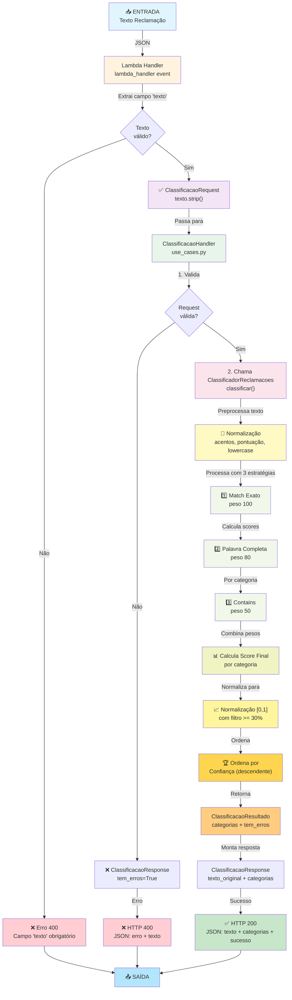
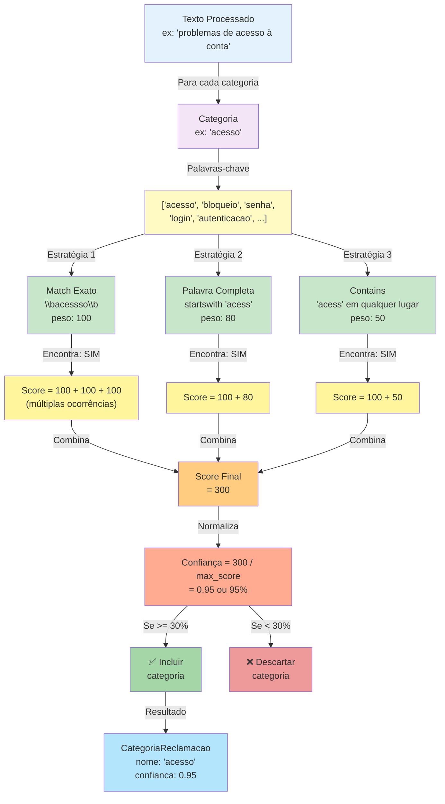
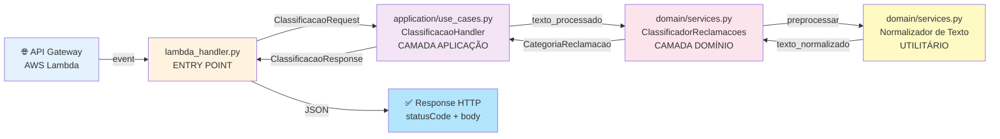
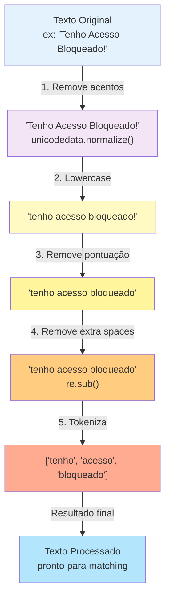
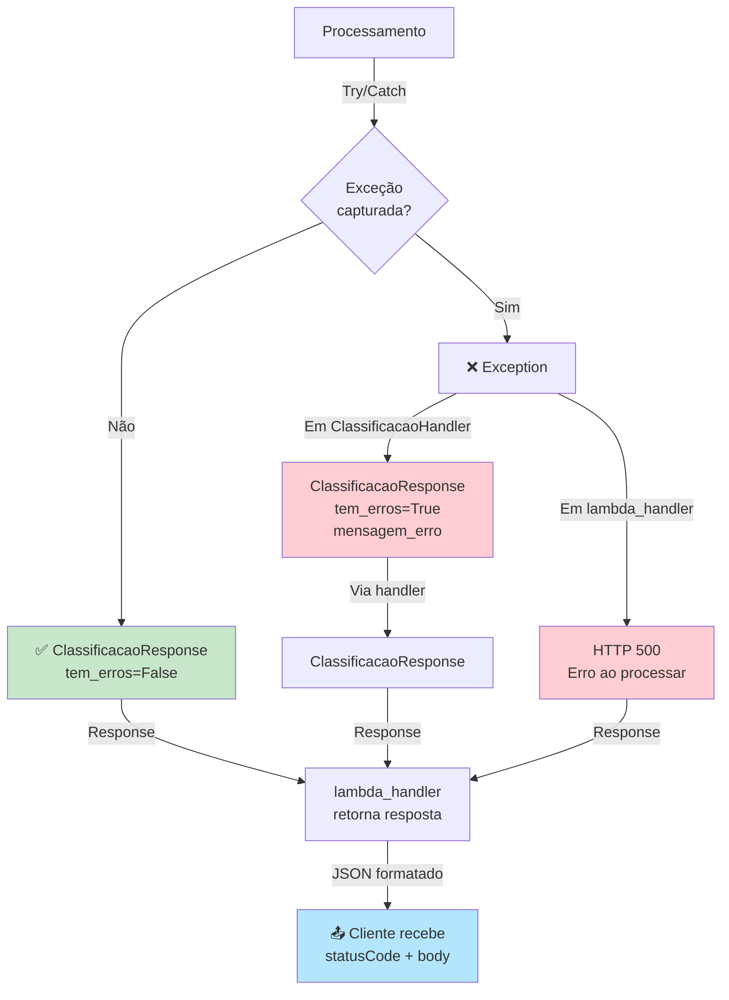

# Diagrama de Fluxo - Classificador de Reclamações

## Fluxo Principal de Classificação



## Detalhamento das 3 Estratégias de Matching



## Arquitetura em Camadas



## Fluxo de Validação de Dados

```mermaid
graph TD
    A["Dados de Entrada"] -->|Body com 'texto'| B{"Body é<br/>string ou dict?"}
    
    B -->|String| C["json.loads()"]
    B -->|Dict| D["Usa direto"]
    
    C -->|Retorna dict| E["Extrai body.get texto"]
    D -->|Dict| E
    
    E -->|Valida| F{"Texto<br/>não vazio?"}
    
    F -->|Não| G["❌ Erro: Campo obrigatório"]
    F -->|Sim| H["Aplica .strip()"]
    
    H -->|ClassificacaoRequest| I{"Dentro do<br/>Handler valida"}
    
    I -->|request.validar()| J{"Comprimento<br/>adequado?"}
    
    J -->|Não| K["❌ Erro validação"]
    J -->|Sim| L["✅ Prossegue para<br/>classificação"]
    
    style A fill:#e3f2fd
    style G fill:#ffcdd2
    style K fill:#ffcdd2
    style L fill:#c8e6c9
    style H fill:#fff9c4
```

## Fluxo de Normalização de Texto



## Fluxo de Tratamento de Erros



---

## Legenda

| Componente | Descrição |
|-----------|-----------|
| 🌐 | API/Entrada externa |
| 📥 | Entrada de dados |
| 📤 | Saída de dados |
| ✅ | Sucesso |
| ❌ | Erro |
| 📝 | Processamento textual |
| 📊 | Cálculo/Processamento |
| 📈 | Normalização |
| 🏆 | Ordenação/Ranking |
| 1️⃣ 2️⃣ 3️⃣ | Múltiplas estratégias |
